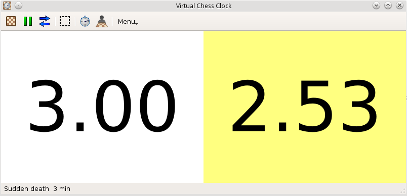
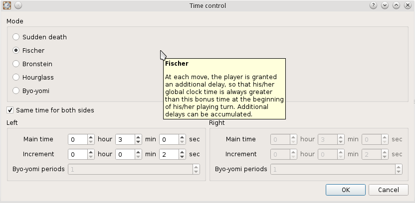
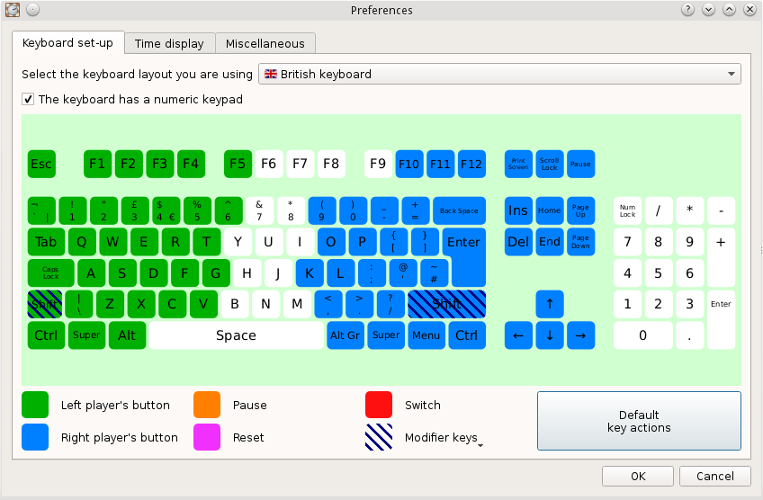

Virtual Chess Clock
===================

Virtual Chess Clock is a [chess clock](http://en.wikipedia.org/wiki/Chess_clock) software:
it can be used to simulate a chess clock on computer (typically a laptop).
Virtual Chess Clock is designed to be easy to use. It is free, open-source and multi-platform.

**http://yo35.org/virtual-chess-clock/**  
https://sourceforge.net/projects/vchessclock/ (project page on SourceForge)   
https://github.com/yo35/vcc (source code on GitHub)

Download
--------

http://yo35.org/virtual-chess-clock/download-vcc/

Features
--------

* Two active key areas on the keyboard (left and right) to operate the clock.
* Support for exotic time control modes such as Fischer, Bronstein, hourglass,
  byo-yomi.
* Time resolution of 1 millisecond.
* Inactivation of most key shortcuts defined by the OS (such as the Windows key
  that triggers the "Start" menu on Windows) when the software is in use.

If you encounter some bugs with this program, or if you wish to get new features
in the future versions, you can report/propose them
in the [GitHub bug tracker](https://github.com/yo35/vcc/issues),
or send an [email to the author](mailto:yo35@melix.net).

Screenshots
-----------

  
The main window.

  
Time control configuration dialog.

  
Keyboard set-up dialog. The function of each key can be finely tuned.

Translation
-----------

Currently, Virtual Chess Clock is available in the following languages:

* English,
* French,
* German,
* Spanish.

If you are interested in translating this program into your language,
please [contact the author](mailto:yo35@melix.net).
Don't be afraid: you don't need any special skill in programming
or software development to achieve this.

Build from source
-----------------

### Required components ###

1. A C++ compiler that supports the C++11 standard (typically, GCC or MinGW >= 4.7).
2. The [CMake](http://www.cmake.org/) build framework (at least version 2.8.11).
3. The [boost libraries](http://www.boost.org/) (at least version 1.49).
4. The [Qt library](http://qt-project.org/) (at least version 5.0).

### Build VCC ###

If your development environment is properly set with the required components,
you should be able to build and install VCC by running the standard
"configure/make/make install" instructions.
This procedure is explained in detail
at http://yo35.org/virtual-chess-clock/build-vcc-from-source/.

Additional details about the available installation options can be obtained
with the command `./configure --help` (or `configure.bat --help` on Windows).
Should you encounter any problems, please report them
[here](https://github.com/yo35/vcc/issues).
